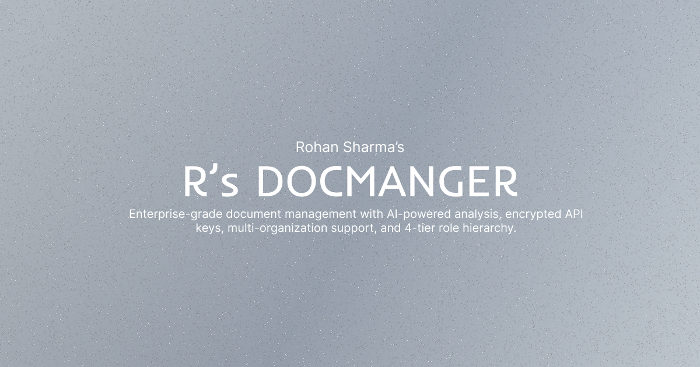

# Radhika's DocManager

A secure, AI-powered document management platform with multi-organization support, 4-tier role-based access control, document viewers, reviewer workflows, and encrypted API key storage.

## Features

- Document upload (PDF, DOCX, TXT, MD, CSV, HTML, JSON) and rich Markdown editor
- Embedded PDF viewer, Word document viewer, Markdown rendered preview, plain text display
- Automatic text extraction for DOCX, TXT, MD, HTML, JSON files on upload
- AI actions: Summarize, Analyze, Improve, Keywords, Translate, Q&A, Insights (Groq/OpenAI/Anthropic)
- Free local tools: Word Count, Structure Analysis, Text Preview (no API key required)
- 4-tier roles: God, Super Admin, Admin, User with hierarchical permissions
- Document classification: Organization, Public, Internal, Confidential, General
- Access levels: View Only, Comment, Edit, Full Access
- Document lifecycle: Draft, Under Review, Published, Archived
- Reviewer assignment (admins and super admins only)
- Document references (cross-linking between documents)
- Password protection (9-digit code, bcrypt hashed)
- Multi-organization support with complete data isolation
- AES-256-GCM encrypted API key storage
- God can publish to all organizations simultaneously (single file upload, multi-org distribution)
- AI agent system with approval workflows

## Tech Stack

| Layer | Technology |
|-------|-----------|
| Framework | Next.js 14 (App Router) |
| Runtime | Bun |
| Language | TypeScript |
| Database | Supabase (PostgreSQL) |
| Authorization | Permit.io + local RBAC |
| Encryption | AES-256-GCM |
| UI | shadcn/ui + Tailwind CSS |
| AI Providers | Groq, OpenAI, Anthropic |
| Parsing | pdf-parse, mammoth |

## Documentation

Full documentation is available in the `/docs` folder and at the `/dashboard/docs` route when running the app.

See [CONTRIBUTING.md](CONTRIBUTING.md) for development setup, architecture, database schema, and detailed role/permission documentation.

## License

[MIT](https://github.com/RS-labhub/AI-DocManager?tab=MIT-1-ov-file)

**Built with ❤️ by [Rohan Sharma](https://github.com/RS-labhub). Named after Radhika Sharma.**

[⭐ Star](https://github.com/RS-labhub/radhika) • [🐛 Issues](https://github.com/RS-labhub/radhika/issues) • [🗣️ Discussions](https://github.com/RS-labhub/radhika/discussions)

